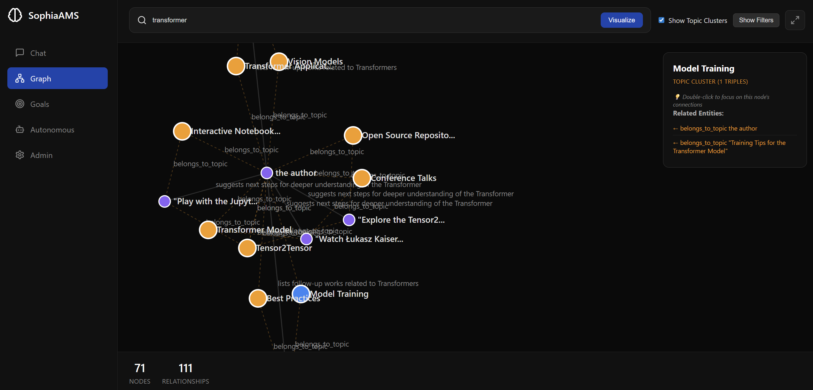
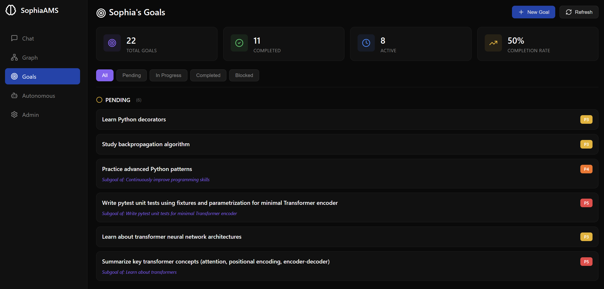

# SophiaAMS
**Associative Semantic Memory System — An autonomous AI agent with persistent knowledge**

SophiaAMS is an event-driven AI agent built on a semantic knowledge graph. It combines conversational memory, goal-driven autonomy, web research skills, and a modern React frontend into a single system that learns and grows from every interaction.





## Key Features

- **Persistent Semantic Memory** — Conversations and documents are extracted into a knowledge graph of semantic triples, recalled automatically on each turn
- **Episodic Memory** — Temporal awareness of past interactions (what happened and when)
- **Goal System** — Hierarchical goals with dependencies, instrumental/forever goals, and autonomous goal pursuit
- **Autonomous Mode** — The agent can work on goals independently: researching, learning, and reporting progress
- **Skill System** — Extensible skills (web search, web reading, goal management, memory queries) loaded dynamically
- **Code Execution** — Sandboxed Python execution in a workspace directory
- **Setup Wizard** — Web-based first-run configuration for LLM connection, personality, and identity
- **React Web UI** — Chat, knowledge graph visualization, goal management, and admin panels

## Quick Start

### 1. Install Dependencies

```bash
# Python dependencies
pip install -r requirements.txt
python -m spacy download en_core_web_sm

# Web frontend
cd sophia-web/server && npm install
cd ../client && npm install
```

### 2. Launch

```bash
python main.py
```

On first run, a **setup wizard** opens in your browser to configure:
- Agent and user names
- LLM connection (any OpenAI-compatible API)
- Personality preset (Magician, Scholar, Companion, or Custom)

After setup, `python main.py` launches the full system — Python backend + web frontend together.

Open **http://localhost:3000** to access the UI.

### 3. Manual Configuration (alternative)

Copy `env_example` to `.env`, edit the values, then create a `.setup_complete` file to skip the wizard:

```bash
cp env_example .env
# Edit .env with your LLM settings
echo done > .setup_complete
python main.py
```

## Architecture

```
python main.py
    ├── EventBus (async priority queue)
    ├── EventProcessor (routes events → agent)
    ├── SophiaAgent (LLM + memory + skills + code runner)
    ├── Adapters
    │   ├── WebUI (HTTP/WebSocket)
    │   ├── Scheduler (cron-like jobs)
    │   ├── Goal Engine (autonomous goal pursuit)
    │   └── Telegram (optional)
    ├── FastAPI server (port 5001)
    ├── Node.js API proxy (port 3001)
    └── Vite React dev server (port 3000)
```

### Core Components

| Component | File | Purpose |
|-----------|------|---------|
| Entry point | `main.py` | Bootstraps everything, first-run detection |
| Agent orchestrator | `sophia_agent.py` | Creates per-session agent loops |
| Agent loop | `agent_loop.py` | Turn-by-turn LLM interaction with tool use |
| LLM client | `llm_client.py` | OpenAI-compatible API wrapper |
| Memory | `AssociativeSemanticMemory.py` | Semantic triple storage and retrieval |
| Knowledge graph | `VectorKnowledgeGraph.py` | Qdrant vector DB layer |
| Episodic memory | `EpisodicMemory.py` | Temporal interaction tracking |
| Stream monitor | `stream_monitor.py` | Auto-recall and memory ingestion middleware |
| Event bus | `event_bus.py` | Async priority event queue |
| Event processor | `event_processor.py` | Event routing and rate limiting |
| Code runner | `code_runner.py` | Sandboxed Python execution |
| Skill loader | `skill_loader.py` | Dynamic skill discovery and loading |
| Setup wizard | `setup_server.py` | First-run configuration API |
| Persona template | `persona_template.txt` | Externalized system prompt |
| Personality presets | `personality_presets.py` | Magician/Scholar/Companion/Custom |
| Config | `sophia_config.yaml` | Adapter and agent settings |

### Memory System

Knowledge is stored as semantic triples with vector embeddings:

```
(Subject, Predicate, Object)
("transformers", "use", "self-attention mechanism")
("Sophia", "is learning about", "neural network architectures")
```

Retrieval combines text similarity, topic matching, and associative expansion.

### Goal System

- **Standard goals** — Completable tasks with priority (1-5)
- **Instrumental goals** — Ongoing strategic objectives that never complete
- **Derived goals** — Auto-spawned from instrumental goals
- **Dependencies** — Goals can block other goals until completed

See [docs/GOAL_SYSTEM_GUIDE.md](docs/GOAL_SYSTEM_GUIDE.md) for details.

## Configuration

### Environment Variables (`.env`)

| Variable | Default | Description |
|----------|---------|-------------|
| `LLM_API_BASE` | `http://localhost:1234/v1` | OpenAI-compatible API endpoint |
| `LLM_API_KEY` | `not-needed` | API key (use `not-needed` for local LLMs) |
| `LLM_MODEL` | — | Model name |
| `LLM_MAX_TOKENS` | `16000` | Max generation tokens |
| `AGENT_PORT` | `5001` | Python backend port |
| `AGENT_NAME` | `Sophia` | Agent identity |
| `USER_NAME` | `User` | User identity |
| `AGENT_TEMPERATURE` | `0.7` | LLM temperature |
| `EMBEDDING_MODEL` | `sentence-transformers/all-MiniLM-L6-v2` | Embedding model |

### Adapter Configuration (`sophia_config.yaml`)

Enable/disable adapters (WebUI, Telegram, Scheduler, Goal Engine) and set parameters like rate limits, cooldowns, and scheduled jobs.

## Testing

```bash
# Unit tests
python -m pytest tests/ -q

# E2E tests (requires running LLM)
python tests/e2e_scenarios.py

# Full scored report
python tests/run_report.py --with-e2e
```

## API Endpoints

| Endpoint | Method | Description |
|----------|--------|-------------|
| `/health` | GET | Health check |
| `/stats` | GET | Knowledge graph statistics |
| `/chat/{session_id}` | POST | Send a message |
| `/chat/{session_id}/stream` | POST | Streaming chat (SSE) |
| `/query` | POST | Search memory |
| `/ingest/document` | POST | Ingest a document |
| `/explore/topics` | GET | Browse topics |
| `/explore/entities` | GET | Browse entities |
| `/explore/overview` | GET | Memory overview |
| `/api/goals` | GET | List goals |
| `/api/goals/create` | POST | Create a goal |
| `/api/goals/update` | POST | Update a goal |
| `/api/goals/suggestion` | GET | Get next suggested goal |
| `/api/autonomous/start` | POST | Start autonomous mode |
| `/api/autonomous/stop` | POST | Stop autonomous mode |

## License

This project is licensed under the MIT License.

---

*SophiaAMS — Persistent memory for autonomous AI agents*
